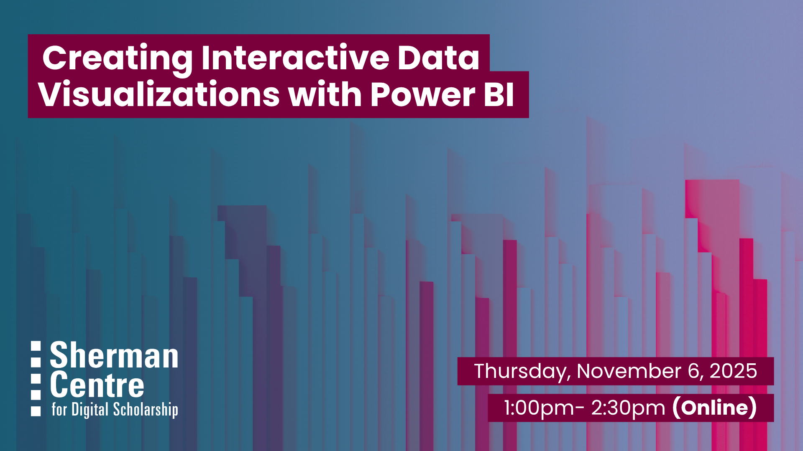

# Creating Interactive Data Visualizations with Power BI

Want to turn your data into clear, compelling visuals? In this beginner-friendly workshop, you will learn how to use Power BI, a powerful tool for building interactive dashboards and charts. Power BI is freely available to McMaster users, making it a great option for coursework, research, and projects. 

In this session, participants will learn to:
- Clean and prepare data
- Create impactful visualizations
- Explore accessibility and design best practices
- Build dashboards that tell your data story

No previous experience with Power BI is required! This session is great for anyone looking to build confidence in data visualization and make more informed decisions through clear, accessible design.

## Workshop Preparation 

Download Power BI Desktop: [https://office365.mcmaster.ca/office-365-3/applications/power-bi/getting-started-with-power-bi/](https://office365.mcmaster.ca/office-365-3/applications/power-bi/getting-started-with-power-bi/)
Please note that this software will only work on Windows OS.

The data that we will be using during the workshop can be downloaded [here](data/PowerBIDataEmissionsTotal.xlsx).

## Facilitator Bio

Subhanya (she/her) brings a background of research in data justice, science and technology studies, and environmental humanities. She is currently thinking through participatory data design which allow for visualizations that are empowering for the end user.

## Workshop Slides

Coming soon.

<!-- <embed src="assets/docs/Creating-and-Sharing-Maps-with-ArcGIS-Online.pdf" style="border:none;" width="100%" height="466px">

[Download as PDF.](assets/docs/Creating-and-Sharing-Maps-with-ArcGIS-Online.pdf)-->
