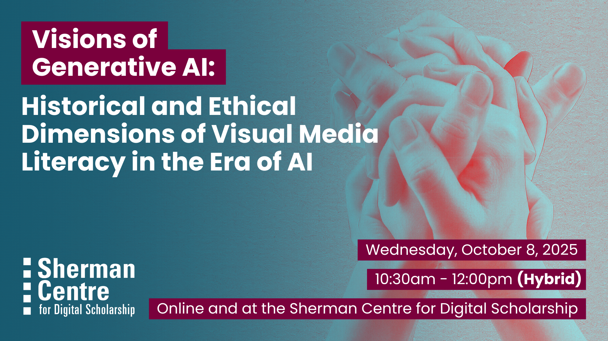

{: .no_toc}
# Visions of Generative AI: Historical and Ethical Dimensions of Visual Media Literacy in the Era of AI

Whether you regularly engage with visual generative AI or are just dipping your toe into these waters, this workshop focuses on recognizing sources of image biases and its impacts and implications as artificial images become increasingly sophisticated and ubiquitous. Applying a combined historical and ethics lens, workshop participants will have the opportunity to generate and analyze artificial images as a means of unpacking continuity and changes in visual practices and norms. The workshop supports the development of critical reflection skills and tools for creating and ‘reading’ images that avoid potential pitfalls of (re)producing harmful clichés and to support identification of mis/disinformation. The workshop has relevance for academic integrity along with navigating our daily visual landscape, which in turn has implications for democracy, civic engagement, and human relationships. At a time when visual evidence/truth, dis/misinformation and academic integrity are at stake, there is no time like the present to gain a solid foundation on visual literacy.

By the end of the workshop, participants will be able to:
- Identify opportunities, pitfalls and potential harms of visual generative AI to make informed decisions on its use in educational and every-day life settings by exploring recent examples.
- Unpack the role of audience engagement with visual images in the era of AI to critically analyse the impacts of and to support responsible use of this new technology.
- Trace biases and ethically problematic visual stereotypes present in AI-generated images through comparison and critical reflection of historical cases

This workshop is great for students, educators, researchers, and professionals interested in developing critical visual literacy skills to responsibly engage with AI-generated images in academic, creative, or everyday contexts!

## Workshop Preparation 

None

## Facilitator Bio

Dr. Sonya de Laat is the Academic Program Advisor and Curriculum Coordinator in the School of Global Health and Social Medicine, and a Research Associate with the Department of Health Research Methods, Evidence, and Impact at McMaster University. With degrees in Anthropology and Media Studies, Dr. de Laat’s work has focused on historical and ethical dimensions of humanitarian visual culture and action. Currently, her focus is on challenging the promises/hopes of photorealistic generative AI and sharing diverse visual histories as a corrective intervention. Her postdoctoral work focused on moral and practical dimensions of palliative care in refugee camps drawing attention to small interventions having big impacts, and the importance of co-design and partnered research. Dr. de Laat is an active member of the Humanitarian Health Ethics research group, and the Canadian Network on Humanitarian History. Representative publications include, “Assembling a global health image: Ethical and pragmatic tensions through the lenses of photographers” (PLOS Glob Public Health 2024), “A case analysis of partnered research on palliative care for refugees in Jordan and Rwanda” (Confl Health 2021), and “The Camera and the Red Cross: ‘Lamentable pictures’ and Conflict Photography Bring into Focus an International Movement, 1855-1865” (IRRC 2021).

<!--Table of contents start here-->

  

    Table of Contents
  

  {: .text-delta }
- TOC
{:toc}

<!--Table of contents ends here-->
<!--## Workshop Slides

Coming soon.

<embed src="assets/docs/Creating-and-Sharing-Maps-with-ArcGIS-Online.pdf" style="border:none;" width="100%" height="466px">

[Download as PDF.](assets/docs/Creating-and-Sharing-Maps-with-ArcGIS-Online.pdf) 

<table style="background-color: #ffff99;">
<tbody>
<tr>
<td>

<b>NOTE:</b>The following content is under development. Workshop videos will be shared below with corresponding interactive components.

</td>
</tr>
</tbody>
</table>
-->

## 1. Introduction

<iframe height="416" width="100%" allowfullscreen frameborder=0 src="https://echo360.ca/media/addd54ee-d454-4c6c-9220-e91f4f3e70a5/public"></iframe>
[View original here.](https://echo360.ca/media/addd54ee-d454-4c6c-9220-e91f4f3e70a5/public)

## 2. Spotting AI Images & Visual Media Literacy Basics 

<!--Embedded multiple choice quiz example 

<iframe src="https://h5pstudio.ecampusontario.ca/h5p/90648/embed" width="964" height="286" frameborder="0" allowfullscreen="allowfullscreen" lang="en" title="The Job Characteristics Model of Motivation"></iframe>
-->

## 3. Intersectionality, Decoloniality, and Historical Thinking

## 4. Histories of Humanitarian Imagery and Photographic Fakery

## 5. Generative AI in Practice: Stereotypes, Safeguards, and Archives

## 6. Conclusion & Additional Resources

