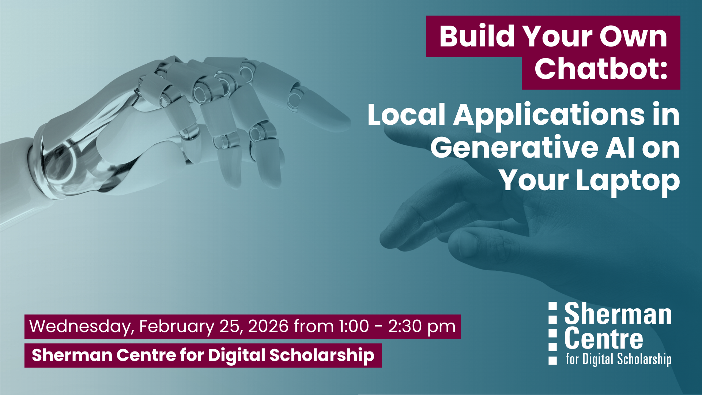

# Build Your Own Chatbot: Local Applications n Generative AI on Your Laptop (Winter 2026)

Most people know cloud-based generative AI tools like ChatGPT, but did you know that the powerful technology behind them—transformer-based Large Language Models (LLMs)—can also run directly on a modern laptop?

In this hands-on, in-person workshop, you’ll explore how these AI systems work and learn how to set up and run a basic chatbot locally on your own computer. Gain a foundational understanding of transformer-based LLMs and discover how to harness their power without relying on the cloud.

By the end of this session, participants will be able to:
- Understand the core principles behind transformer-based large language models
- Set up and run a basic chatbot AI on a personal laptop
- Explore practical applications and limitations of locally hosted generative AI

This session is perfect for anyone curious about AI who wants to experiment with running models independently!

## Workshop Preparation 

None

## Facilitator Bio

John Fink is the Digital Scholarship Librarian in the Sherman Centre.

## Workshop Slides

Coming soon.
