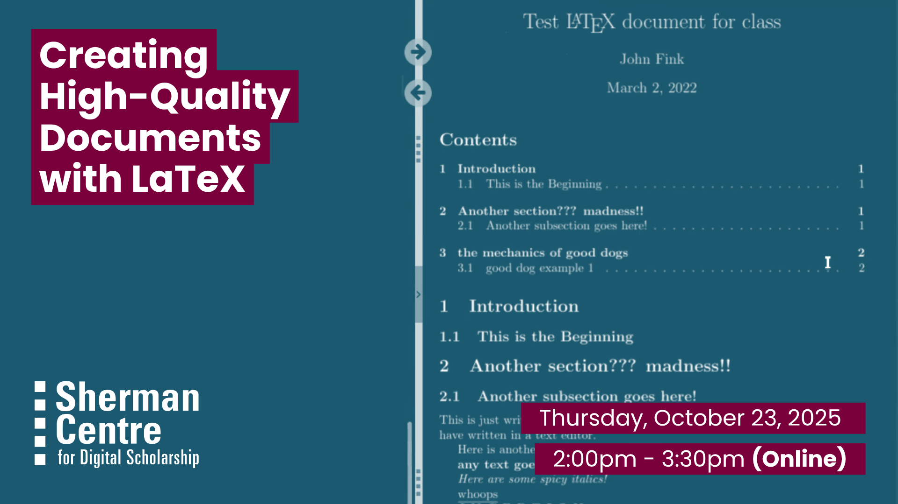

# Creating High-Quality Documents with LaTeX

Want more control over how your documents look and function? LaTeX is an open-source typesetting system used to create clean, consistent, and professional documents. It’s especially helpful for working with complex formatting, citations, or mathematical content, and it's a powerful tool for writing reports, articles, and long-form texts in any discipline.

In this beginner-friendly workshop, you’ll learn the building blocks of LaTeX, including how to format text, structure a document, and write equations. You’ll also walk through the process of creating your first LaTeX document from scratch.

By the end of this session, participants will be able to:
- Identify the basic structure and purpose of LaTeX documents
- Format text and write mathematical equations using LaTeX commands
- Create and compile a basic LaTeX document

This session is ideal for students, researchers, and writers in any field who want to explore LaTeX as a powerful alternative to traditional word processors—no prior experience required.

## Workshop Preparation 

Register for an account on [https://overleaf.com](https://overleaf.com)

## Facilitator Bio

John Fink is the Digital Scholarship Librarian in the Sherman Centre.

## Workshop Slides

<embed src="assets/docs/20251023-latex.pdf" style="border:none;" width="100%" height="466px">

[Download as PDF.](assets/docs/20251023-latex.pdf)-->

## Workshop Recording

<iframe height="416" width="100%" allowfullscreen frameborder=0 src="https://echo360.ca/media/8b0653e4-d828-43e5-94f5-997c186dfc9a/public"></iframe>
[View original here.](https://echo360.ca/media/8b0653e4-d828-43e5-94f5-997c186dfc9a/public)
