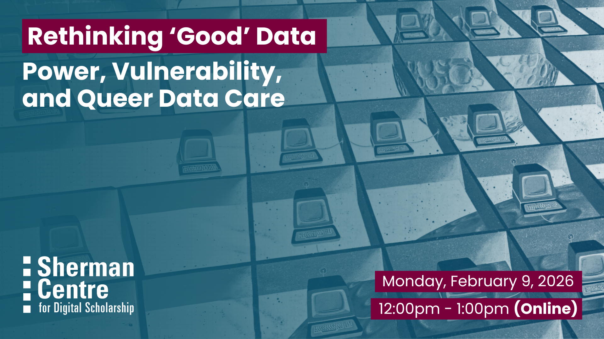

# Rethinking "Good" Data: Power, Vulnerability and Queer Data Care

## Workshop Preparation 

## Facilitator Bio

## Workshop Slides

<!-- <embed src="assets/docs/Creating-and-Sharing-Maps-with-ArcGIS-Online.pdf" style="border:none;" width="100%" height="466px">

[Download as PDF.](assets/docs/Creating-and-Sharing-Maps-with-ArcGIS-Online.pdf)-->