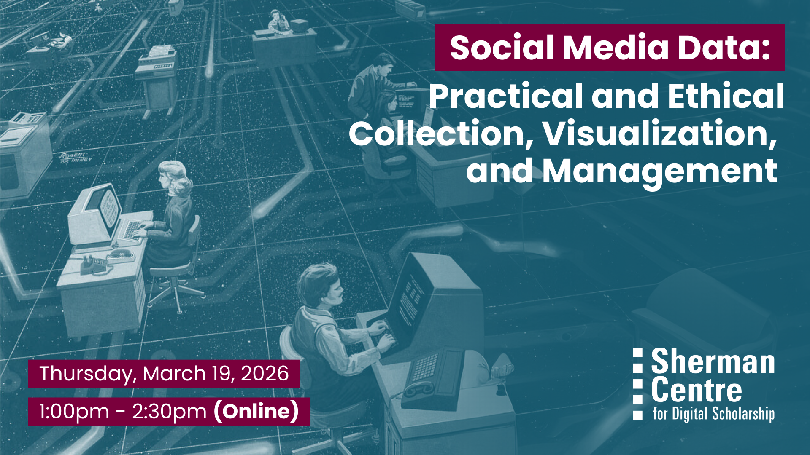

# Social Media Data: Practical and Ethical Collection, Visualization and Management

From Reddit threads to TikTok trends, social media is deeply embedded in our daily lives. These platforms fuel polarization, connect queer communities, raise awareness about rare diseases, amplify both grassroots movements and gender-based violence, and even shape the new recipes we cook for dinner. With this flood of seemingly public content, it’s no surprise that researchers are increasingly turning to social media as a rich (and complicated!) source of data.

This hands-on workshop covers both practical techniques and ethical considerations for working with social media data. You’ll learn from experts across digital scholarship, research data management, and data analysis:

How to Collect to Social Media Data: Digital Scholarship Librarian John Fink will demo manual collection and scraping tools like the Digital Methods Initiative's Zeeschuimer and 4CAT. 

How to Analyze Social Media Data: Data Analysis and Visualization Librarian Subhanya Sivajothy will intro how to comb through social media data and show patterns. 

How to Manage Social Media Data: Research Data Management Specialist Danica Evering will share tools and best practices for wrangling and organizing social media data. 

How to Navigate Social Media Data Ethics: Digital Scholarship Coordinator Alexis-Carlota Cochrane will explore ethical considerations for researching social media, including strategies for protecting privacy and minimizing harm throughout the research and publication process.

By the end of this workshop, participants will be able to:
* Collect social media data using both manual and automated scraping tools like Zeeschuimer and 4CAT.
* Analyze datasets to identify key trends and insights with introductory data exploration techniques.
* Organize and manage social media data effectively by applying recommended best practices and tools.
* Understand and address ethical challenges in social media research, including protecting privacy and minimizing harm at all stages.

This session is ideal for researchers, students, and practitioners across disciplines who are curious about using social media data in their work and want to approach it thoughtfully, ethically, and responsibly.

## Workshop Preparation 

None

## Facilitator Bio

## Workshop Slides

<!-- <embed src="assets/docs/Creating-and-Sharing-Maps-with-ArcGIS-Online.pdf" style="border:none;" width="100%" height="466px">

[Download as PDF.](assets/docs/Creating-and-Sharing-Maps-with-ArcGIS-Online.pdf)-->