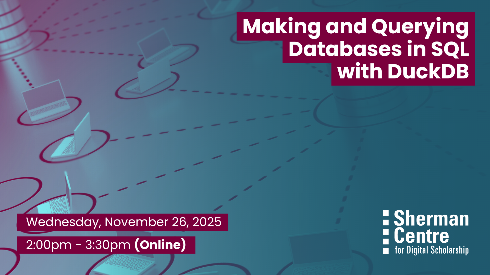

# Making and Querying Databases in SQL with DuckDB

Want to work with structured data more efficiently? SQL (Structured Query Language) is a powerful tool for managing and analyzing data and it’s easier to get started than you might think.

This beginner-friendly workshop introduces SQL using DuckDB, a lightweight, cross-platform database that runs locally and requires no setup. Through hands-on practice, you’ll learn how to create a database, add data to it, and write queries to find the information you need.

By the end of this session, participants will be able to:
* Understand the basic structure and purpose of SQL
* Create and populate a DuckDB database
* Write and run basic SQL queries to explore and extract data

This session is ideal for beginners in data analysis, researchers, and students who want a gentle introduction to databases using a simple and powerful tool. No prior experience required!

## Workshop Preparation 

## Facilitator Bio

John Fink is the Digital Scholarship Librarian in the Sherman Centre.

## Workshop Slides

<!-- <embed src="assets/docs/Creating-and-Sharing-Maps-with-ArcGIS-Online.pdf" style="border:none;" width="100%" height="466px">

[Download as PDF.](assets/docs/Creating-and-Sharing-Maps-with-ArcGIS-Online.pdf)-->