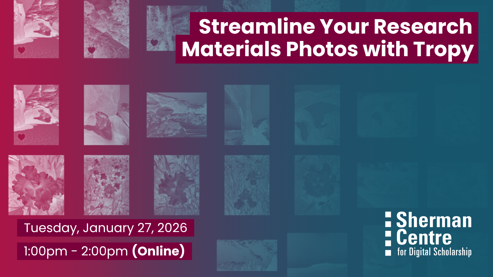

# Streamline Your Research Materials with Tropys

You've been there--getting home from an incredible research trip to an archive, maps collection, or gallery only to face down thousands of photos all labelled "IMG50293.png." Join Research Data Management Specialist Danica Evering and Data Analysis and Visualization Librarian Subhanya Sivajothy for an overview of Tropy: a free and open-source solution to explore and manage research photos. In this webinar, you will learn how to use Tropy to zoom into details, tag and organize content with metadata, and begin uncovering patterns across your sources. We will also explore how Tropy connects with Zotero for reference management and Omeka for building digital exhibits, offering a full workflow from research to public presentation.

In this hands-on workshop, participants will learn to:
- Use Tropy to organize, annotate, analyze and manage research materials image collections.
- Select appropriate metadata and implement documentation and tagging systems.
- Integrate Tropy with Zotero and Omeka to cite archival sources and enhance the impact of your research and digital exhibitions.

No prior knowledge of the software will be required but please come with a version of the software downloaded for the demo [https://tropy.org/](https://tropy.org/)! We'll be doing some hands-on experimentation with the software to get you familiar with these tools.  

## Workshop Preparation 
Download Tropy [https://tropy.org/](https://tropy.org/) and Zotero [https://www.zotero.org/download/](https://www.zotero.org/download/)

## Facilitator Bio

Danica Evering holds broad experience with research support, education, project management, advocacy, and knowledge translation; with fluency in social practice art, healthcare, community research, data, and systems development. Danica supports students, postdocs, faculty, and staff with RDM through the data lifecycle—Data Management Plans, storage and backup, data security, data sharing. With an MA in Media Studies from Concordia, they are interested in fostering RDM within curious scholars and disciplines.

Subhanya Sivajothy (she/her) brings a background of research in data justice, science and technology studies, and environmental humanities. She is currently thinking through participatory data design which allow for visualizations that are empowering for the end user.

## Workshop Slides

Coming soon.

<!-- <embed src="assets/docs/Creating-and-Sharing-Maps-with-ArcGIS-Online.pdf" style="border:none;" width="100%" height="466px">

[Download as PDF.](assets/docs/Creating-and-Sharing-Maps-with-ArcGIS-Online.pdf)-->

## Workshop Recording

<iframe height="416" width="100%" allowfullscreen frameborder=0 src="https://echo360.ca/media/3a095b81-79ce-4cad-a156-7484ab52e8ec/public"></iframe>
[View original here.](https://echo360.ca/media/3a095b81-79ce-4cad-a156-7484ab52e8ec/public)
